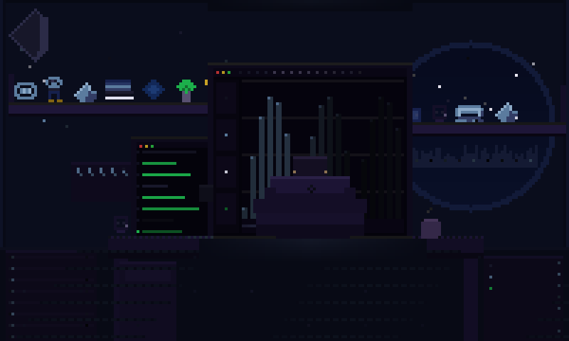

<div align="center">


<br/>


</div>

<br/>

<div align="center">
  
</div>

<br/>

---

<div align="center">

```
        AI Engineer  ·  Data Scientist  ·  Builder of Production Systems
              Python · FastAPI · Next.js · Claude · PyTorch · RAG
                      Casablanca, Morocco → the world
```

</div>

---

## `> whoami`

I'm **Oussama** (SKAY) — Computer Engineering student at ISGA Casablanca, specializing in Big Data & AI.

I don't build demos. I build systems that survive production: multi-modal AI pipelines, RAG engines with epistemic awareness, full-stack applications that ship and stay shipped.

INFJ. Thinks in systems. Builds in Python. Obsessed with the gap between raw data and real intelligence.

<br/>

---

## `> ls ./building`

<div align="center">

| Project | What it is | Stack | Status |
|:--------|:-----------|:------|:------:|
| [**AURA**](https://github.com/skayy47/AURA) | Universal AI data engine — ingest, clean, explore & chat with any data format (tabular, PDF, audio, video, multilingual OCR) | `Python` `Streamlit` `Claude` `GPT-4o` `Whisper` `OpenCV` `Tesseract` | ✅ `V2 Shipped` |
| [**nexus**](https://github.com/skayy47/nexus) | Institutional memory RAG engine — contradiction detection, hybrid BM25+pgvector retrieval, confidence scoring, SSE streaming | `FastAPI` `Next.js 14` `LangChain` `pgvector` `Groq` `Supabase` `Docker` | 🚀 `Live` |
| `PROJECT-3` | Coming soon | `—` | 🔨 `In Progress` |
| `PROJECT-4` | Coming soon | `—` | 📋 `Planned` |

</div>

<br/>

---

## `> cat skills.json`

<div align="center">

### ⬡ Languages & Core


### ⬡ AI · Machine Learning · Deep Learning


### ⬡ LLMs · Generative AI · RAG


### ⬡ Data Engineering · MLOps


### ⬡ Vision · Audio · OCR


### ⬡ Backend · APIs


### ⬡ Frontend


### ⬡ Databases · Vector Stores


### ⬡ DevOps · Infrastructure


</div>

<br/>

---

## `> ping me`

<div align="center">

📧 **[oussamaiskia@gmail.com](mailto:oussamaiskia@gmail.com)**

*Portfolio & LinkedIn — shipping soon.*

<br/>

> *"The machine learns. I make sure it learns the right thing."*

</div>

<br/>

<div align="center">

</div>
